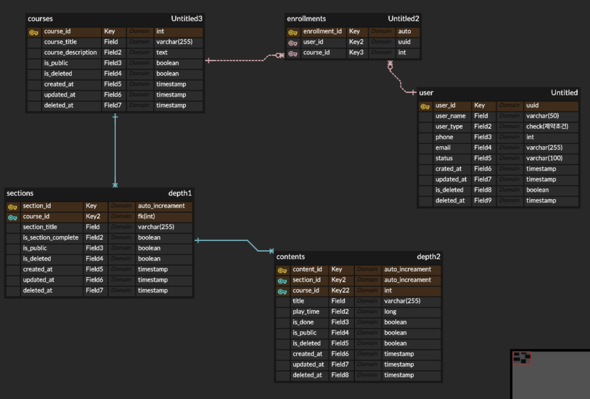

# LXP Project

## 목적

LXP 사이트를 직접 구현해봄으로써, `Java` 및 `JDBC` 기반의 `CRUD`를 통해 `Controller`, `Service`, `Repository` 영역의 역할에 대해
깊이 이해하고, 이를
통해 실제 `CRUD`를 구현할 수 있다.

## DTO 구조 가이드

### 강의 생성

CreateCourseRequest
|-- CourseInsertDTO
|-- List<SectionInsertDTO>
| ㄴ-- List<ContentInsertDTO>

## ERD

### 초안

1. 강좌 개설 및 조회, 수정, 삭제가 가능하다.
2. 강좌 개설 시, `user` 타입 중 `teacher` 타입만이 강의 개설이 가능하다.
3. 강좌는 `Courses` > `Section` > `Contents` 순으로 상세해지며, 각 모든 값은 개별적으로 공개 여부와 삭제 여부를 설정할 수 있다.
4. 모든 강의 관련은 soft delete가 적용되며, course, section, content는 모두 개별 삭제 및 비공개가 가능하다.
5. 단, course가 오픈 되기 위해서는 최소 하나의 section과 하나의 content를 가지고 있어야 한다.

### 수정안

![이미지 추가 예정]
> 보완사항
> 1. 기존의 설계대로 적용하면 한명이 하나의 강좌를 수강 완료한 순간, 다른 사람에게는 수강 완료로 표기되어짐
> 2. 따라서, 수강 완료에 대한 조건은 강의 테이블이 아닌 수강등록 테이블에서 회원별로 관리가 이루어져야한다.

### 테스트